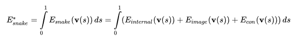
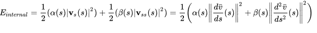
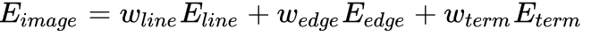
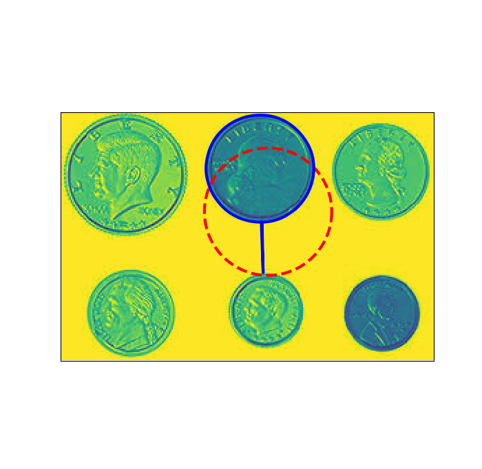
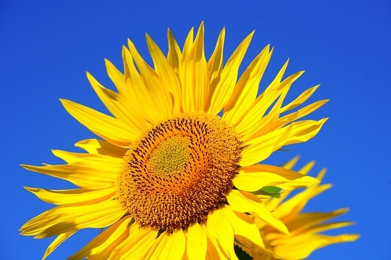
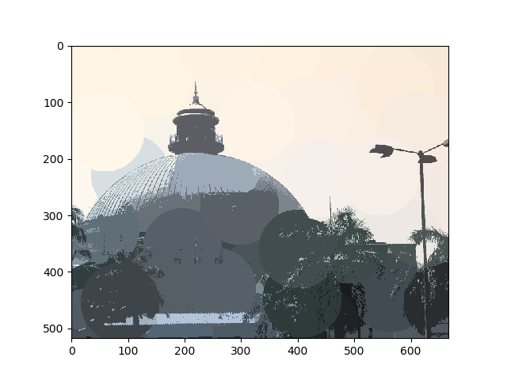
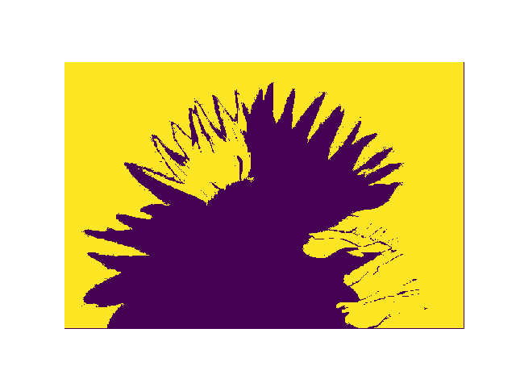
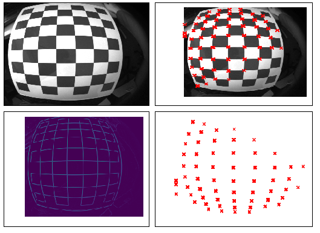

# **Task 3**
# Names
* Abdelrahman Ahmed Ramzy
* Ahmed Fawzi Hosni
* Moaz Khairy Hussein

# **Snake Active Contour**

## Working principle
The code itself in the GUI, takes from the user multiple parameters:
* Alpha
* Beta
* Gamma
* Wline
* Wedge

Then the user has to specify 2 points on the uploaded image for the center of the contour and to calculate the radius of the contour.
Then the user enters the number of points that make the contour or the circumference of the contour.
The radius if left as is, then it will make a circle, but by adjusting the values of both a & b the user can make an ellipse.
After all the parameters are set, the snake is calculated.

## Problems
* the processor itself was overwhelmed at times, so had to use built-in filters in the calculations.
* When we tried to make the whole contour user-made, the calculations were incorrect and the snake wouldn't be generated correctly, thus we had to make sure that it was a clear looking ellipse or circle.

## Steps

* We start by edge detection using the Sobel filter to calculate the Image Energy.
* We then calculate the Internal Energy to construct our snake.
* We the calculate the energy minimization as Visible image boundaries represent a low energy state for the active contour.
## Results

# **Segmentation**
### Definition
###### Clustering can be defined as the grouping of data points based on some commonality or similarity between the points.

## K-means Clustering
### Working principle
The code itself runs when the user chooses the K-means from the combo-box,
then chooses 2 points on the loaded image, after the 2 points are correctly chosen,
the user clicks the set button which activates the function holding the algorithm,
and the result appears to the user, for the user to re-enter new values he has to click the reset button 1st.
### Steps
* The RGB values of the chosen pixels are retrieved.
* We calculate Euclidean distance between the initial points and all the pixels in the image matrix.
* The next step is finding the minimum value among the two clusters and fetch their corresponding cluster index.
* We the compute the mean of the pixel values with respect to each cluster.
Once we obtain the mean value for the Red, Green and Blue channels separately, find the difference between the new values and the current values.
* If the difference is more than the threshold value then assign the new values
to the current values and continue from the third step i.e calculating the Euclidean distance else stop the process and display the clustered image.

### Results
The images below are the original image, followed by the segmentation of its core.

## Mean-Shift Clustering
### Working principle
We have 2 modes to choose from, Mode 1 or Mode 2, they decide whether to segment based on 1 or 2 thresholds.
The user then enters either the 1 threshold (H) or the 2 (Hr & Hs).
The user then Applies the changes after making sure the combo-box is Mean-Shift.
### Steps
* It works by placing a Gaussian kernel on each point in the data set.
* Adding all of the individual kernels up generates a probability surface (e.g., density function).
Depending on the kernel bandwidth parameter used, the resultant density function will vary.
* Then the points are shifted together resulting in clusters of points.
* To sum up, the mean shift algorithm iteratively shifts each point in the data set until it the top of its nearest kernel surface peak.

### Results
The images below are the original image, followed by its mean shift.

## Region-Growing
### Working principle
The user first chooses an image, then chooses the initial point.
### Steps
* The gray scaled image is linear scaled from 0:255
* A 3X3 Kernel is set on each pixel to examine its neighbors and see whether its homogenous or not.
* The homogeneity is determined based on 2 thresholds, which are the pixel value +5 & the pixel value -5
* Then the whole image is examined by this kernel.
* Each neighboring homogenous pixels are added to an empty segmented image array.
* The new array contains the new clustered image.

### Results
The images below are the original image, after applying the Region-Growing algorithm.

# **Corners detection by Harris:**
## Steps about our Code:
- load image RGB and convert to gray image
- apply gaussian filter on gray image for smoothing to suppress noise
- apply sobel kernels detection on smoothed image to get derivatives in x-direction and y-direction
- construct Hessian matrix on whole image that consists of Ixx, Iyy, Ixy
- for more robust detection we construct Hessian matrix (M_hat) on specific window not on whole image, so we do that by apply gaussian kernel
- so, to detect corners in window, we depend on eigen values from Hessian matrix
- so, to evaluate eigen values and their effects on detection we get corner response parameter (R) which depends on eigen values and emperical constant (K) in range from 0.04 : 0.06
- finally we compare (R) with threshold to detect corners and making non-maximum suppression
- when (R) is larger than threshold will be corner indication

## Results:

## References
[1] https://github.com/scikit-image/scikit-image/blob/master/skimage/segmentation/active_contour_model.py#L7  
[2] https://www.cs.cmu.edu/~galeotti/methods_course/Segmentation2-Snakes.pdf  
[3] https://www.cs.cmu.edu/~galeotti/methods_course/Segmentation2-Snakes.pdf  
[4] https://sbme-tutorials.github.io/2019/cv/presentations/5_week5/#1  
[5] https://github.com/parag-datar/mean-shift-clustering  
[6] https://www.imageeprocessing.com/2017/12/k-means-clustering-on-rgb-image.html  
[7] https://spin.atomicobject.com/2015/05/26/mean-shift-clustering/  
[8] https://github.com/suhas-nithyanand/Image-Segmentation-using-Region-Growing  
